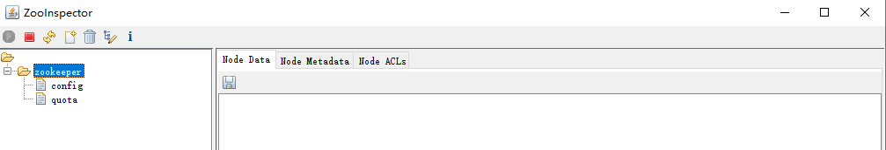
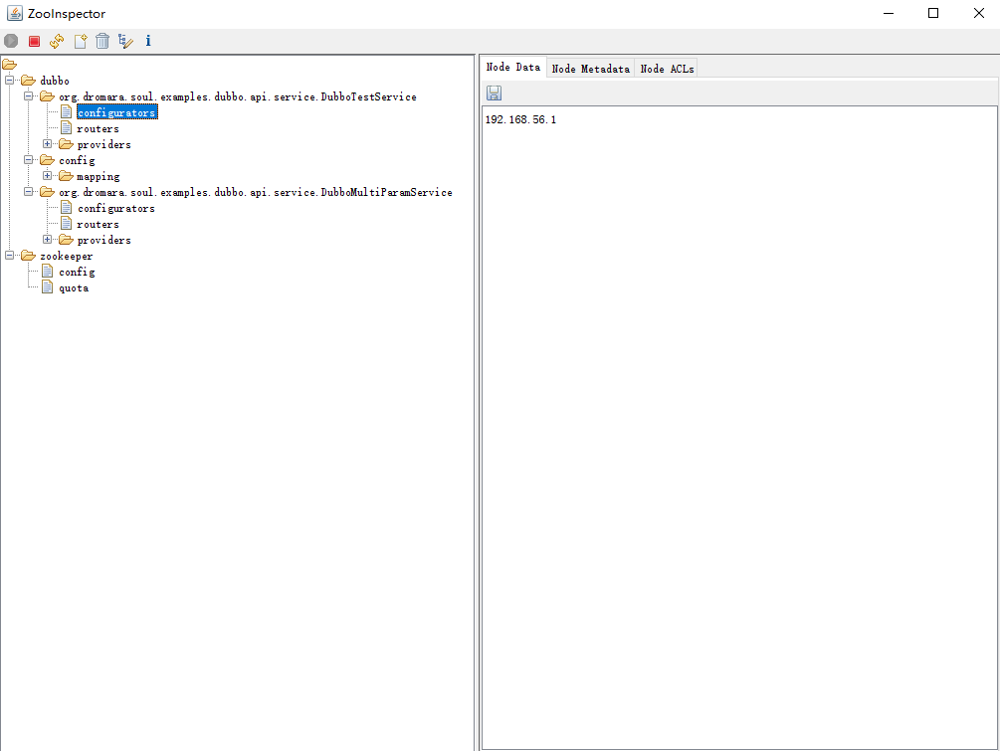
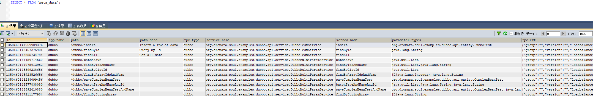

### soul dubbo插件

#### 一、dubbo 插件是什么

* dubbo插件是将`http协议` 转换成`dubbo协议` 的插件，也是网关实现dubbo泛化调用的关键

#### 二、准备环境

* 安装zookeeper

  * 直接使用 `docker`安装即可，简单方便，命令如下：

    ```xml
     > docker pull zookeeper
     > docker run --privileged=true -d --name zookeeper --publish 2181:2181  -d zookeeper:latest
     > docker ps # 查看是否已经启动
    ```

* 安装客户端

  * 下载 `ZooInspector.zip`,解压

  * 执行 `java -jar ZooInspector.jar` （ZooInspector\build\ZooInspector.jar）

    

* 总结

  * 由于 dubbo 插件需要使用到 zk ，所以提前将 zk环境搭建起来，使用docker 搭建还是很方便的。

#### 三、代理过程

  ##### 1. 启动 

* 首先，我们肯定要登录soul-admin 后台`插件管理` 开启 dubbo 插件

* 启动 `TestApacheDubboApplication` 

* 启动完成后，我们可以看到如下内容：

  

  已经将选择器与规则数据同步到数据库中，**数据同步的具体源码分析后面会写单独文章分析**

  

  
  
  综上，通过阅读官方文档了解到，dubbo 插件需要依赖元数据 与 注册中心（本人使用zk） ，所以，当我们看到上面的消息事，代表服务已经能够正常启动，下面让我们来请求服务，感受一下 dubbo 插件是如何 将`http协议` 转换成`dubbo协议`。

##### 2.代理流程

* 发起 http://localhost:9195/dubbo/findById 请求

* 查看是否有返回结果

  ```json
  {"code":200,"message":"Access to success!","data":{"name":"hello world Soul Apache, findById","id":"1"}}
  ```

  我们可以看到返回值，证明dubbo 插件已经可以正常使用

  ```json
  // 提示：如果不能正常获取到返回值，请在 admin 后台管理 检查 dubbo插件是否是开发状态，
  {"code":-103,"message":"Service invocation exception, or no result is returned!","data":null}
  ```


##### 3.源码分析

* 经过昨天的学习，我们很容易定位到核心代码  

   * [参考地址](https://github.com/KuanYa/soul-study/tree/main/day02 )

   `AlibabaDubboPlugin` 本次需要分析的插件,结合下面的代码，分析一下，`doExecute`主要做了什么？

   * 获取body ，里面是请求的参数信息
   * 获取SoulContext ，里面保存着 contextPath
   * 获取MetaData，对应到 `meta_data`中的数据，同时内存中也保留一份
   * alibabaDubboProxyService.genericInvoker(body, metaData)，这里是执行泛化调用的入口

   ````java
     	@Override
     	    protected Mono<Void> doExecute(final ServerWebExchange exchange, final SoulPluginChain chain, final SelectorData selector, final RuleData rule) {
     	        String body = exchange.getAttribute(Constants.DUBBO_PARAMS);
     	        SoulContext soulContext = exchange.getAttribute(Constants.CONTEXT);
     	        assert soulContext != null;
     	        MetaData metaData = exchange.getAttribute(Constants.META_DATA);
     	        if (!checkMetaData(metaData)) {
     	            assert metaData != null;
     	            log.error(" path is :{}, meta data have error.... {}", soulContext.getPath(), metaData.toString());
     	            exchange.getResponse().setStatusCode(HttpStatus.INTERNAL_SERVER_ERROR);
     	            Object error = SoulResultWrap.error(SoulResultEnum.META_DATA_ERROR.getCode(), SoulResultEnum.META_DATA_ERROR.getMsg(), null);
     	            return WebFluxResultUtils.result(exchange, error);
     	        }
     	        if (StringUtils.isNoneBlank(metaData.getParameterTypes()) && StringUtils.isBlank(body)) {
     	            exchange.getResponse().setStatusCode(HttpStatus.INTERNAL_SERVER_ERROR);
     	            Object error = SoulResultWrap.error(SoulResultEnum.DUBBO_HAVE_BODY_PARAM.getCode(), SoulResultEnum.DUBBO_HAVE_BODY_PARAM.getMsg(), null);
     	            return WebFluxResultUtils.result(exchange, error);
     	        }
     	        // 实际上是在这里会执行dubbo 的泛化调用，让我进去看一下
     	        Object result = alibabaDubboProxyService.genericInvoker(body, metaData);
     	        if (Objects.nonNull(result)) {
     	            exchange.getAttributes().put(Constants.DUBBO_RPC_RESULT, result);
     	        } else {
     	            exchange.getAttributes().put(Constants.DUBBO_RPC_RESULT, Constants.DUBBO_RPC_RESULT_EMPTY);
     	        }
     	        exchange.getAttributes().put(Constants.CLIENT_RESPONSE_RESULT_TYPE, ResultEnum.SUCCESS.getName());
     	        return chain.execute(exchange);
     	    }
   ````

   分析完`doExecute` 方法后，继续分析`genericInvoker` 方法，分析一下，`genericInvoker`主要做了什么？

   * reference , 根据路径获取接口配置信息
   * genericService，获取泛化调用的接口类
   * buildParameter , 组装参数
   * genericService#$invoke， 真正调用dubbo的 泛化调用接口

   ````
       // 当前方法为dubbo 泛化调用的开始
     	public Object genericInvoker(final String body, final MetaData metaData) throws SoulException {
     	    	// 结合zk ,在缓存中获取到dubbo 泛化服务接口的信息
     	        ReferenceConfig<GenericService> reference = ApplicationConfigCache.getInstance().get(metaData.getPath());
     	        if (Objects.isNull(reference) || StringUtils.isEmpty(reference.getInterface())) {
     	            ApplicationConfigCache.getInstance().invalidate(metaData.getPath());
     	            reference = ApplicationConfigCache.getInstance().initRef(metaData);
     	        }
     	        GenericService genericService = reference.get();
     	        try {
     	            Pair<String[], Object[]> pair;
     	            if (ParamCheckUtils.dubboBodyIsEmpty(body)) {
     	                pair = new ImmutablePair<>(new String[]{}, new Object[]{});
     	            } else {
     	                pair = dubboParamResolveService.buildParameter(body, metaData.getParameterTypes());
     	            }
     	            // 执行泛化调用方法，获取到返回值，或真正请求到实际服务上
     	            return genericService.$invoke(metaData.getMethodName(), pair.getLeft(), pair.getRight());
     	        } catch (GenericException e) {
     	            log.error("dubbo invoker have exception", e);
     	            throw new SoulException(e.getExceptionMessage());
     	        }
     	    }
   ````
   
   综上：soul 中 关于dubbo 插件的使用及相关源码大致流程分析完毕。

##### 4.总结

​		通过今天的分析，大致了解了dubbo的插件的工作原理，一个http 请求，是如何通过dubbo插件转化为 RPC 调用的，以前只听说过RPC、Dubbo等，没有真正使用过，今天正好上手体验了一番。

​	后续需要深入学习点有如下：

* dubbo 深入学习
* soul 网关的数据同步，如何同步到JVM内存中

​		以上就是本次的分析内容，不足之处还请指教。