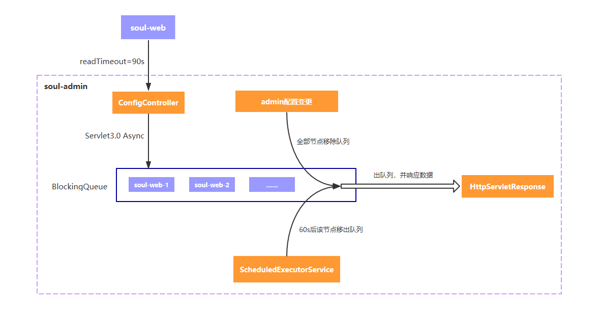
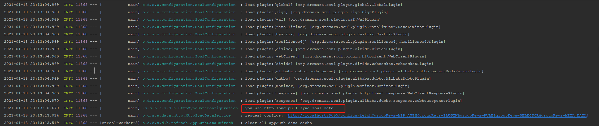

#### Soul数据同步原理之http长轮询

##### 1. 前言

* Soul提供三种数据同步机制，分别为 `zookeeper`、`webosocket`、`http 长轮询`，其中，`http 长轮询`则为`2.x`版本以后默认的数据同步机制，

  三种同步机制本质上是为了将数据同步到JVM的hashMap中，每次请求访问本地缓存，提高响应速度。

##### 2. http长轮询原理

​	

##### 3.开启http长轮询机制

* `soul-admin` 中开启 `application.yml`

  ```yml
  soul:
    database:
      dialect: mysql
      init_script: "META-INF/schema.sql"
    sync:
    #  websocket:
    #    enabled: true
    #    zookeeper:
    #        url: localhost:2181
    #        sessionTimeout: 5000
    #        connectionTimeout: 2000
        http:
          enabled: true # 开启
  ```

* `soul-bootstrap`中开启 `application-loal.yml`

  ```yaml
  soul :
      file:
        enabled: true
      corss:
        enabled: true
      dubbo :
        parameter: multi
      sync:
      #    websocket :
      #         urls: ws://localhost:9095/websocket
  
  #        zookeeper:
  #             url: localhost:2181
  #             sessionTimeout: 5000
  #             connectionTimeout: 2000
          http:
               url : http://localhost:9095 # admin 地址
  ```

* 验证`http长轮询`机制是否已打开

  * 启动 `soul-admin`

  * 启动`soul-bootstrap` ,启动成功后，会看到如下日志

    

    **从日志中，我们可以看到，数据同步机制已经修改为`http 长轮询`**

##### 4.源码分析

​	**前言**：本次分析我们从上图中的关键日志入手，此日志是从哪里输出的？，我们可以全局搜索一下，如下：

````java
	@Bean
    public SyncDataService httpSyncDataService(final ObjectProvider<HttpConfig> httpConfig, 
                                               final ObjectProvider<PluginDataSubscriber> pluginSubscriber,
                                           	   final ObjectProvider<List<MetaDataSubscriber>> metaSubscribers, 
                                               final ObjectProvider<List<AuthDataSubscriber>> authSubscribers) {
        log.info("you use http long pull sync soul data");
        return new HttpSyncDataService(
            	Objects.requireNonNull(httpConfig.getIfAvailable()), 
            	Objects.requireNonNull(pluginSubscriber.getIfAvailable()),
                metaSubscribers.getIfAvailable(Collections::emptyList), 
            	authSubscribers.getIfAvailable(Collections::emptyList)
        		);
    }
````

当我们找到日志所在方法时，自然可以定位到所在类`HttpSyncDataConfiguration`,不难得出，`HttpSyncDataConfiguration` 是一个配置类，启动`soul-bootstrap`时注入，同时，在`httpSyncDataService`这一个方法中，发现了`new HttpSyncDataService()`,依次走下去，如下：

```java
public HttpSyncDataService(final HttpConfig httpConfig, 
						   final PluginDataSubscriber pluginDataSubscriber,
                           final List<MetaDataSubscriber> metaDataSubscribers, 
                           final List<AuthDataSubscriber> authDataSubscribers) {
        this.factory = new DataRefreshFactory(pluginDataSubscriber, metaDataSubscribers, authDataSubscribers);
        this.httpConfig = httpConfig;
        this.serverList = Lists.newArrayList(Splitter.on(",").split(httpConfig.getUrl()));
        this.httpClient = createRestTemplate();
       // 启动http 长轮询的任务
        this.start(); 
    }
```

进入到`this.start();`中，我们发现，`start()`方法实际上是开启长轮询线程定时任务的方法

```java
private void start() {
        // It could be initialized multiple times, so you need to control that.
        if (RUNNING.compareAndSet(false, true)) {
            // fetch all group configs.
            this.fetchGroupConfig(ConfigGroupEnum.values());
            int threadSize = serverList.size();
            this.executor = new ThreadPoolExecutor(threadSize, threadSize, 60L, TimeUnit.SECONDS,
                    new LinkedBlockingQueue<>(),
                    SoulThreadFactory.create("http-long-polling", true));
            // start long polling, each server creates a thread to listen for changes.
            this.serverList.forEach(server -> this.executor.execute(new HttpLongPollingTask(server)));
        } else {
            log.info("soul http long polling was started, executor=[{}]", executor);
        }
    }
```

**`serverList` 服务端的地址集合，笔者任认为，是指 `soul-admin`，并且后面可以存在多个`soul-admin`服务端的**。

````java
class HttpLongPollingTask implements Runnable {

        private String server;

        private final int retryTimes = 3;

        HttpLongPollingTask(final String server) {
            this.server = server;
        }

        @Override
        public void run() {
            while (RUNNING.get()) {
                for (int time = 1; time <= retryTimes; time++) {
                    try {
                        // 执行长轮询
                        doLongPolling(server);
                    } catch (Exception e) {
                        // print warnning log.
                        if (time < retryTimes) {
                            log.warn("Long polling failed, tried {} times, {} times left, will be suspended for a while! {}",
                                    time, retryTimes - time, e.getMessage());
                            ThreadUtils.sleep(TimeUnit.SECONDS, 5);
                            continue;
                        }
                        // print error, then suspended for a while.
                        log.error("Long polling failed, try again after 5 minutes!", e);
                        ThreadUtils.sleep(TimeUnit.MINUTES, 5);
                    }
                }
            }
            log.warn("Stop http long polling.");
        }
    }
````

本次的分析暂时到这里，后面会继续分析

##### 5.总结

​	`http 长轮询`的核心原理就是，在启动`soul-bootstrap`时，会创建出执行定时轮训任务的线程池，定时不断去`soul-admin`中请求数据，更新数据到JVM中。


**收获：**

* 了解soul http长轮询`机制流程，初步了解实现原理
* `ScheduledExecutorService ` 线程池

**不足：**

* 对于长轮询的定时执行代码上理解的还不够清晰，后续需要继续深入理解


