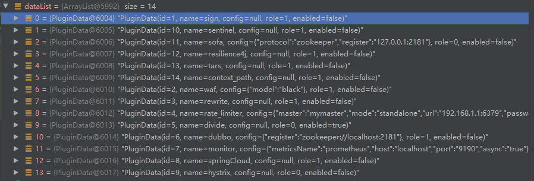
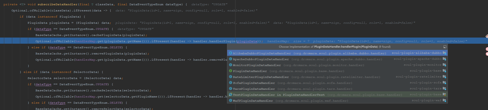
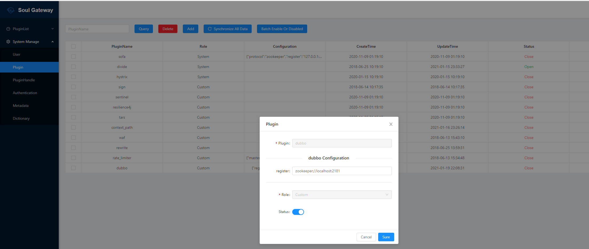
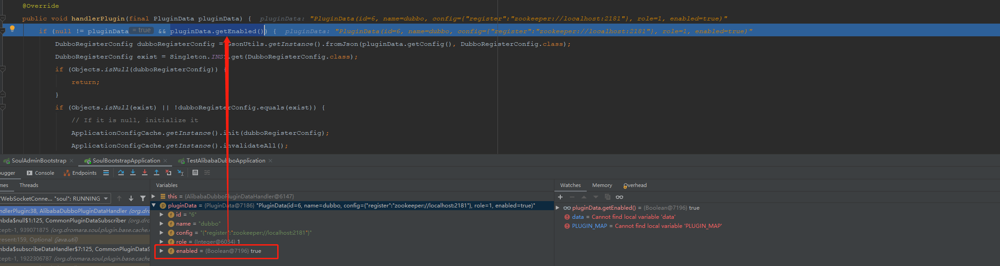

#### Soul数据同步原理之Websocket

#### 1.启动`admin-bootstrap` 报错分析

* 前言： 今天按照平时操作一样，将数据同步机制修改为`websocket`（后面说明） ,依次启动`soul-admin`、`soul-bootstrap`时，发现`admin-bootstrap`出现如下错误：

  ```java
  java.lang.IllegalStateException: No such application config! Please add <dubbo:application name="..." /> to your spring config.
  	at com.alibaba.dubbo.config.AbstractInterfaceConfig.checkApplication(AbstractInterfaceConfig.java:145) ~[dubbo-2.6.5.jar:2.6.5]
  	at com.alibaba.dubbo.config.ReferenceConfig.init(ReferenceConfig.java:278) ~[dubbo-2.6.5.jar:2.6.5]
  	at com.alibaba.dubbo.config.ReferenceConfig.get(ReferenceConfig.java:163) ~[dubbo-2.6.5.jar:2.6.5]
  	at org.dromara.soul.plugin.alibaba.dubbo.cache.ApplicationConfigCache.build(ApplicationConfigCache.java:166) ~[classes/:na]
  	at org.dromara.soul.plugin.alibaba.dubbo.cache.ApplicationConfigCache.initRef(ApplicationConfigCache.java:130) ~[classes/:na]
  	at org.dromara.soul.plugin.alibaba.dubbo.subscriber.AlibabaDubboMetaDataSubscriber.onSubscribe(AlibabaDubboMetaDataSubscriber.java:43) ~[classes/:na]
  	at org.dromara.soul.plugin.sync.data.weboscket.handler.MetaDataHandler.lambda$null$0(MetaDataHandler.java:42) ~[classes/:na]
  	at java.util.ArrayList.forEach(ArrayList.java:1257) ~[na:1.8.0_181]
  	at org.dromara.soul.plugin.sync.data.weboscket.handler.MetaDataHandler.lambda$doRefresh$1(MetaDataHandler.java:42) ~[classes/:na]
  	at java.util.ArrayList.forEach(ArrayList.java:1257) ~[na:1.8.0_181]
  	at org.dromara.soul.plugin.sync.data.weboscket.handler.MetaDataHandler.doRefresh(MetaDataHandler.java:42) ~[classes/:na]
  	at org.dromara.soul.plugin.sync.data.weboscket.handler.AbstractDataHandler.handle(AbstractDataHandler.java:68) ~[classes/:na]
  	at org.dromara.soul.plugin.sync.data.weboscket.handler.WebsocketDataHandler.executor(WebsocketDataHandler.java:61) ~[classes/:na]
  	at org.dromara.soul.plugin.sync.data.weboscket.client.SoulWebsocketClient.handleResult(SoulWebsocketClient.java:87) ~[classes/:na]
  	at org.dromara.soul.plugin.sync.data.weboscket.client.SoulWebsocketClient.onMessage(SoulWebsocketClient.java:68) ~[classes/:na]
  	at org.java_websocket.client.WebSocketClient.onWebsocketMessage(WebSocketClient.java:591) [Java-WebSocket-1.5.0.jar:na]
  	at org.java_websocket.drafts.Draft_6455.processFrameText(Draft_6455.java:885) [Java-WebSocket-1.5.0.jar:na]
  	at org.java_websocket.drafts.Draft_6455.processFrame(Draft_6455.java:819) [Java-WebSocket-1.5.0.jar:na]
  	at org.java_websocket.WebSocketImpl.decodeFrames(WebSocketImpl.java:379) [Java-WebSocket-1.5.0.jar:na]
  	at org.java_websocket.WebSocketImpl.decode(WebSocketImpl.java:216) [Java-WebSocket-1.5.0.jar:na]
  	at org.java_websocket.client.WebSocketClient.run(WebSocketClient.java:508) [Java-WebSocket-1.5.0.jar:na]
  	at java.lang.Thread.run(Thread.java:748) [na:1.8.0_181]
  ```

  所以，先让我们来解决报错产生的原因，通过抛出的异常信息，分析整个调用链后,debug后，当我们走到如下方法时：

  ```java
  @Override
      public void handle(final String json, final String eventType) {
          List<T> dataList = convert(json);
          if (CollectionUtils.isNotEmpty(dataList)) {
              DataEventTypeEnum eventTypeEnum = DataEventTypeEnum.acquireByName(eventType);
              switch (eventTypeEnum) {
                  case REFRESH:
                  case MYSELF:
                      // 此时的 dataList 保存的是插件的信息
                      doRefresh(dataList);
                      break;
                  case UPDATE:
                  case CREATE:
                      doUpdate(dataList);
                      break;
                  case DELETE:
                      doDelete(dataList);
                      break;
                  default:
                      break;
              }
          }
      }
  ```

  

  

  当调试到这里是，可以怀疑是不是插件出现了问题，通过不断的进入方法，可以进入到如下方法：

  ```java
  private <T> void subscribeDataHandler(final T classData, final DataEventTypeEnum dataType) {
      Optional.ofNullable(classData).ifPresent(data -> {
      	// data 为 插件类型的
          if (data instanceof PluginData) {
              PluginData pluginData = (PluginData) data;
              // dataType 为 UPDATE
              if (dataType == DataEventTypeEnum.UPDATE) {
                  BaseDataCache.getInstance().cachePluginData(pluginData);
                  // 所以会进入到如下方法，我们在这里进入
                  Optional.ofNullable(handlerMap.get(pluginData.getName())).ifPresent(handler -> handler.handlerPlugin(pluginData));
              } else if (dataType == DataEventTypeEnum.DELETE) {
                  BaseDataCache.getInstance().removePluginData(pluginData);
                  Optional.ofNullable(handlerMap.get(pluginData.getName())).ifPresent(handler -> handler.removePlugin(pluginData));
              }
          } else if (data instanceof SelectorData) {
              SelectorData selectorData = (SelectorData) data;
              if (dataType == DataEventTypeEnum.UPDATE) {
                  BaseDataCache.getInstance().cacheSelectData(selectorData);
                  Optional.ofNullable(handlerMap.get(selectorData.getPluginName())).ifPresent(handler -> handler.handlerSelector(selectorData));
              } else if (dataType == DataEventTypeEnum.DELETE) {
                  BaseDataCache.getInstance().removeSelectData(selectorData);
                  Optional.ofNullable(handlerMap.get(selectorData.getPluginName())).ifPresent(handler -> handler.removeSelector(selectorData));
              }
          } else if (data instanceof RuleData) {
              RuleData ruleData = (RuleData) data;
              if (dataType == DataEventTypeEnum.UPDATE) {
                  BaseDataCache.getInstance().cacheRuleData(ruleData);
                  Optional.ofNullable(handlerMap.get(ruleData.getPluginName())).ifPresent(handler -> handler.handlerRule(ruleData));
              } else if (dataType == DataEventTypeEnum.DELETE) {
                  BaseDataCache.getInstance().removeRuleData(ruleData);
                  Optional.ofNullable(handlerMap.get(ruleData.getPluginName())).ifPresent(handler -> handler.removeRule(ruleData));
              }
          }
      });
  }
  ```

  在上面的代码中，我们发现程序会进入`handler.handlerPlugin(pluginData)`这个方法中，所以我们选择进入：

  

  这个时候我们`AlibabaDubboPluginDataHandler`中，因为：

  * 我们错误日志中，提示的时`dubbo`相关的错误，

  * 并且日志看到了`AlibabaDubboMetaDataSubscriber` 类型

  ```java
  @Override
  public void handlerPlugin(final PluginData pluginData) {
      // 当断点走到此处时，我们发现 pluginData.getEnabled() 为 false
      // 然后结合下面的代码，发现，没有初始化 ApplicationConfigCache，这个可能是导致报错的原因
      // 通过这几天对Soul 的理解， 插件的 enabled 是可以在admin 后台配置的，所以，我们查看后台的配置，改为true
      if (null != pluginData && pluginData.getEnabled()) {
          DubboRegisterConfig dubboRegisterConfig = GsonUtils.getInstance().fromJson(pluginData.getConfig(), DubboRegisterConfig.class);
          DubboRegisterConfig exist = Singleton.INST.get(DubboRegisterConfig.class);
          if (Objects.isNull(dubboRegisterConfig)) {
              return;
          }
          if (Objects.isNull(exist) || !dubboRegisterConfig.equals(exist)) {
              // If it is null, initialize it
              ApplicationConfigCache.getInstance().init(dubboRegisterConfig);
              ApplicationConfigCache.getInstance().invalidateAll();
          }
          Singleton.INST.single(DubboRegisterConfig.class, dubboRegisterConfig);
      }
  }
  ```

  

  我们在后台打开插件的开关，重新启动 `admin-bootstrap`插件，查看是否还会出现上述错误。

  * **当我程序断点还在执行中，我去`admin`后台将`dubbo` 插件的打开，在此回到程序查看，我们发现：**

    

    **小结论：进一步验证`soul` 数据的同步，是会更新到JVM 的缓存中，可以实现实时生效的作用。**

* 结论

  * 查看日志或者重新启动`soul-bootstrap`，没有发现上述报错，证明我们的猜测和解决办法是生效的
  * 对于数据`soul` 的同学，可能很快甚至直接猜测出问题的原因，但是，通过这一次的错误的排查，了解 订阅插件的一个大致流程，还有有一个收获的。

#### 2.打开`Websocket`数据同步机制

* `soul-admin`修改`application.yml`

  ```yaml
  soul:
    database:
      dialect: mysql
      init_script: "META-INF/schema.sql"
    sync:
      websocket:
        enabled: true # 开启
    #    zookeeper:
    #        url: localhost:2181
    #        sessionTimeout: 5000
    #        connectionTimeout: 2000
    #    http:
    #     enabled: true
  ```

* `soul-bootstrap` 修改`application-loacl.yml`

  ```yaml
  soul :
      file:
        enabled: true
      corss:
        enabled: true
      dubbo :
        parameter: multi
      sync:
          websocket :
               urls: ws://localhost:9095/websocket # 建立链接地址
  ```

#### 3.什么是`Websocket`

* [参考链接一](https://www.infoq.cn/article/deep-in-websocket-protocol)
* [参考链接二](https://xie.infoq.cn/article/a8e2add215d08aa82715196b6)

* 特点：

  > ​	1. WebSocket 可以在浏览器里使用。
  >
  > ​	2. 支持双向通信。
  >
  > ​	3. 使用很简单。

* 优点：

  > 1. 支持双向通信，实时性更强。
  >
  > 2. 更好的二进制支持。
  >
  > 3. 较少的控制开销。连接创建后，ws 客户端、服务端进行数据交换时，协议控制的数据包头部较小。在不包含头部的情况下，服务端到客户端的包头只有 2~10 字节（取决于数据包长度），客户端到服务端的的话，需要加上额外的 4 字节的掩码。而 HTTP 协议每次通信都需要携带完整的头部。
  >
  > 4. 支持扩展。ws 协议定义了扩展，用户可以扩展协议，或者实现自定义的子协议。（比如支持自定义压缩算法等）。

#### 4.soul 如何使用

* 主要分析模块

  > soul-sync-data-center  ——> soul-sync-data-websocket

* 切入点

  > `SoulWebsocketClient.java`

* 明天继续分析，今天有点特殊状况。。。。。

#### 5. 总结

* 通过对报错信息的分析，了解了插件订阅的大概流程
* get到 什么是`Websocket`