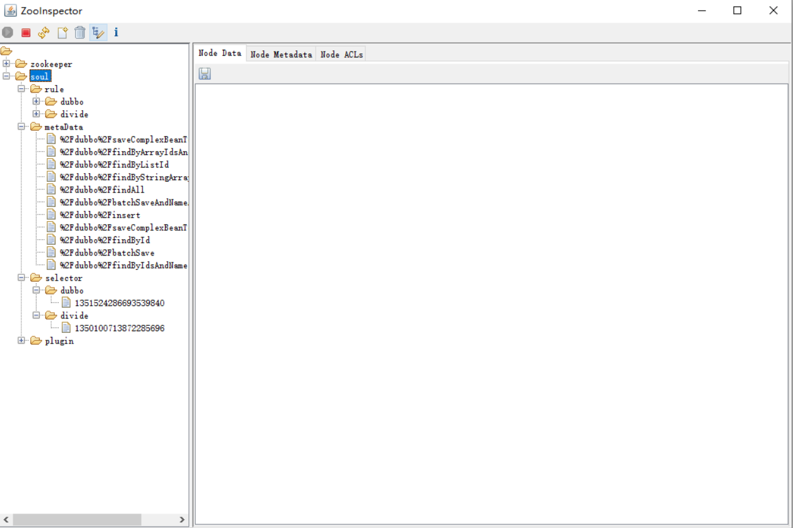

#### 数据同步之`zookeeper`

##### １.什么是`zookeeper`

* `ZooKeeper` 是一个分布式的，开放源码的分布式应用程序协同服务。

  `ZooKeeper` 的设计目标是将那些复杂且容易出错的分布式一致性服务封装起来，

  构成一个高效可靠的原语集，并以一系列简单易用的接口提供给用户使用

* **典型应用场景**

  * 配置管理（configurationmanagement） 

  * DNS服务

  * 组成员管理（groupmembership） 

  *  各种分布式锁

  > Zookeepers 适用于存储和协同相关的关键数据，不适合用于大数据量存储

##### 2.`zookeeper`在soul的使用方式 

* 依赖 `zookeeper` 的 watch 机制。

* `soul-admin`启动时会将数据全量写入到`zookeeper `中，后续存在数据更新，则增量更新`zookeeper `节点的数据。

* `soul-web`会监听节点信息的变化，同步更新到本地缓存中。

##### 3.源码解析

* 启动`zookeeper`数据同步机制

  `soul-admin` 下   `application.yml`

  ```yaml
  soul:
    database:
      dialect: mysql
      init_script: "META-INF/schema.sql"
    sync:
      #websocket:
        #enabled: false # 由于soul默认数据同步机制是 Websocket 所以需要手动关闭，排除干扰
        zookeeper:
            url: localhost:2181
            sessionTimeout: 5000
            connectionTimeout: 2000
  ```

  `soul-bootstrap` 下 `application-local.yml`

  ```yml
  soul :
      file:
        enabled: true
      corss:
        enabled: true
      dubbo :
        parameter: multi
      sync:
          #websocket :
               #urls: ws://localhost:9095/websocket
  
          zookeeper:
               url: localhost:2181
               sessionTimeout: 5000
               connectionTimeout: 2000
  ```

  

* 启动`soul-admin` 启动时创建 `zk` 客户端

  ```java
  /**
   * The type Zookeeper listener.
   */
  @Configuration
  @ConditionalOnProperty(prefix = "soul.sync.zookeeper", name = "url")
  // 启动时，会先执行，此处创建 ZKClient
@Import(ZookeeperConfiguration.class) 
  static class ZookeeperListener {

      /**
       * Config event listener data changed listener.
       *
       * @param zkClient the zk client
       * @return the data changed listener
       */
      @Bean
      @ConditionalOnMissingBean(ZookeeperDataChangedListener.class)
      public DataChangedListener zookeeperDataChangedListener(final ZkClient zkClient) {
          // 创建ZK数据变更监听
          return new ZookeeperDataChangedListener(zkClient);
      }
  
      /**
       * Zookeeper data init zookeeper data init.
       *
       * @param zkClient        the zk client
       * @param syncDataService the sync data service
       * @return the zookeeper data init
       */
      @Bean
      @ConditionalOnMissingBean(ZookeeperDataInit.class)
      public ZookeeperDataInit zookeeperDataInit(final ZkClient zkClient, final SyncDataService syncDataService) {
          // 初始化数据
          return new ZookeeperDataInit(zkClient, syncDataService);
      }
  }
  ```
  
  ```java
  @Bean
  @ConditionalOnMissingBean(ZkClient.class)
  public ZkClient zkClient(final ZookeeperProperties zookeeperProp) {
      return new ZkClient(zookeeperProp.getUrl(), zookeeperProp.getSessionTimeout(), zookeeperProp.getConnectionTimeout());
  }	
  ```
  
**全量同步数据到ZK中**
  
  ```java
  // CommandLineRunner 接口可以实现，启动成功后，执行 run 方法
  public class ZookeeperDataInit implements CommandLineRunner {
  
      private final ZkClient zkClient;
  
      private final SyncDataService syncDataService;
  
      /**
       * Instantiates a new Zookeeper data init.
       *
       * @param zkClient        the zk client
       * @param syncDataService the sync data service
       */
      public ZookeeperDataInit(final ZkClient zkClient, final SyncDataService syncDataService) {
          this.zkClient = zkClient;
          this.syncDataService = syncDataService;
      }
  
      @Override
      public void run(final String... args) {
          String pluginPath = ZkPathConstants.PLUGIN_PARENT;
          String authPath = ZkPathConstants.APP_AUTH_PARENT;
          String metaDataPath = ZkPathConstants.META_DATA;
          if (!zkClient.exists(pluginPath) && !zkClient.exists(authPath) && !zkClient.exists(metaDataPath)) {
              syncDataService.syncAll(DataEventTypeEnum.REFRESH);
          }
      }
  }
  ```
  
  
  
  ```java
  @Override
  public boolean syncAll(final DataEventTypeEnum type) {
      appAuthService.syncData();
      List<PluginData> pluginDataList = pluginService.listAll();
      // eventPublisher ——> ApplicationEventPublisher 发布时间，对应监听者会收到消息
      eventPublisher.publishEvent(new DataChangedEvent(ConfigGroupEnum.PLUGIN, type, pluginDataList));
      List<SelectorData> selectorDataList = selectorService.listAll();
      eventPublisher.publishEvent(new DataChangedEvent(ConfigGroupEnum.SELECTOR, type, selectorDataList));
      List<RuleData> ruleDataList = ruleService.listAll();
      eventPublisher.publishEvent(new DataChangedEvent(ConfigGroupEnum.RULE, type, ruleDataList));
      metaDataService.syncData();
      return true;
  }
  ```
  
  ```
  // 对应的插件监听者会收到消息，将插件信息写入到ZK中
  // 选择器，规则，元数据 同理
  @Override
  public void onPluginChanged(final List<PluginData> changed, final DataEventTypeEnum eventType) {
      for (PluginData data : changed) {
          final String pluginPath = ZkPathConstants.buildPluginPath(data.getName());
          // delete
          if (eventType == DataEventTypeEnum.DELETE) {
              deleteZkPathRecursive(pluginPath);
              final String selectorParentPath = ZkPathConstants.buildSelectorParentPath(data.getName());
              deleteZkPathRecursive(selectorParentPath);
              final String ruleParentPath = ZkPathConstants.buildRuleParentPath(data.getName());
              deleteZkPathRecursive(ruleParentPath);
              continue;
          }
          //create or update
          upsertZkNode(pluginPath, data);
      }
  }
  ```
  
  至此，启动`soul-admin`全量同步数据完成，连接`zk` 查看数据是否已经同步成功
  
  


* 启动 `soul-bootstrap` 

  * 上面了解到，`soul` 中 `zk`同步数据利用到 `watcher` 机制，基于之前的经验 可以在  `soul-sync-data-center`  下 `soul-sync-data-zookeeper` 找到

    `ZookeeperSyncDataService.java`

    ```java
    public ZookeeperSyncDataService(final ZkClient zkClient, final PluginDataSubscriber pluginDataSubscriber,
                                    final List<MetaDataSubscriber> metaDataSubscribers, final List<AuthDataSubscriber> authDataSubscribers) {
        this.zkClient = zkClient;
        this.pluginDataSubscriber = pluginDataSubscriber;
        this.metaDataSubscribers = metaDataSubscribers;
        this.authDataSubscribers = authDataSubscribers;
        // 创建监听
        watcherData();
        watchAppAuth();
        watchMetaData();
    }
    ```

    ```java
    private void watcherAll(final String pluginName) {
        // 插件
        watcherPlugin(pluginName);
        // 选择器
        watcherSelector(pluginName);
        // 规则
        watcherRule(pluginName);
    }
    ```

    ```java
    private void watcherPlugin(final String pluginName) {
        String pluginPath = ZkPathConstants.buildPluginPath(pluginName);
        if (!zkClient.exists(pluginPath)) {
            zkClient.createPersistent(pluginPath, true);
        }
        // 将插件数据更新在缓存中
        cachePluginData(zkClient.readData(pluginPath));
        // 监听或订阅数据变化
        subscribePluginDataChanges(pluginPath, pluginName);
    }
    ```

  * 小结

    * 通过上述分析，`soul` 中 使用 `zk` 数据同步机制已经梳理清楚

      > 1.`soul-admin`启动时，创建客户端,创建监听，同步数据到`zk`中
      >
      > 2.`soul-boostrap`启动是，将数据`zk`中数据保存到本地缓存，与`zk` 创建监听，监控数据变化

* 演示`zk` 数据同步

  * `zk` 数据同步机制是可以增量更新的，如下：

    ```java
    @Override
    @Transactional(rollbackFor = Exception.class)
    public String createOrUpdate(final PluginDTO pluginDTO) {
        final String msg = checkData(pluginDTO);
        if (StringUtils.isNoneBlank(msg)) {
            return msg;
        }
        PluginDO pluginDO = PluginDO.buildPluginDO(pluginDTO);
        DataEventTypeEnum eventType = DataEventTypeEnum.CREATE;
        if (StringUtils.isBlank(pluginDTO.getId())) {
            pluginMapper.insertSelective(pluginDO);
        } else {
            eventType = DataEventTypeEnum.UPDATE;
            pluginMapper.updateSelective(pluginDO);
        }
    
        // 发布监听事件，监听器会收到对应的事件
        eventPublisher.publishEvent(new DataChangedEvent(ConfigGroupEnum.PLUGIN, eventType,
                Collections.singletonList(PluginTransfer.INSTANCE.mapToData(pluginDO))));
        return StringUtils.EMPTY;
    }
    ```

    ```java
    public void onApplicationEvent(final DataChangedEvent event) {
        for (DataChangedListener listener : listeners) {
            switch (event.getGroupKey()) {
                case APP_AUTH:
                    listener.onAppAuthChanged((List<AppAuthData>) event.getSource(), event.getEventType());
                    break;
                case PLUGIN:
                    // 执行插件的变更监听
                    listener.onPluginChanged((List<PluginData>) event.getSource(), event.getEventType());
                    break;
                case RULE:
                    listener.onRuleChanged((List<RuleData>) event.getSource(), event.getEventType());
                    break;
                case SELECTOR:
                    listener.onSelectorChanged((List<SelectorData>) event.getSource(), event.getEventType());
                    break;
                case META_DATA:
                    listener.onMetaDataChanged((List<MetaData>) event.getSource(), event.getEventType());
                    break;
                default:
                    throw new IllegalStateException("Unexpected value: " + event.getGroupKey());
            }
        }
    }
    ```

    ```
    // 当在后台admin中修改插件时，onPluginChanged 会自动监听到
    @Override
    public void onPluginChanged(final List<PluginData> changed, final DataEventTypeEnum eventType) {
        for (PluginData data : changed) {
            final String pluginPath = ZkPathConstants.buildPluginPath(data.getName());
            // delete
            if (eventType == DataEventTypeEnum.DELETE) {
                deleteZkPathRecursive(pluginPath);
                final String selectorParentPath = ZkPathConstants.buildSelectorParentPath(data.getName());
                deleteZkPathRecursive(selectorParentPath);
                final String ruleParentPath = ZkPathConstants.buildRuleParentPath(data.getName());
                deleteZkPathRecursive(ruleParentPath);
                continue;
            }
            // create or update
            upsertZkNode(pluginPath, data);
        }
    }
    ```

##### 4.总结

* 今天主要分析了使用`zk`同步数据，简要流程如下：

  

  