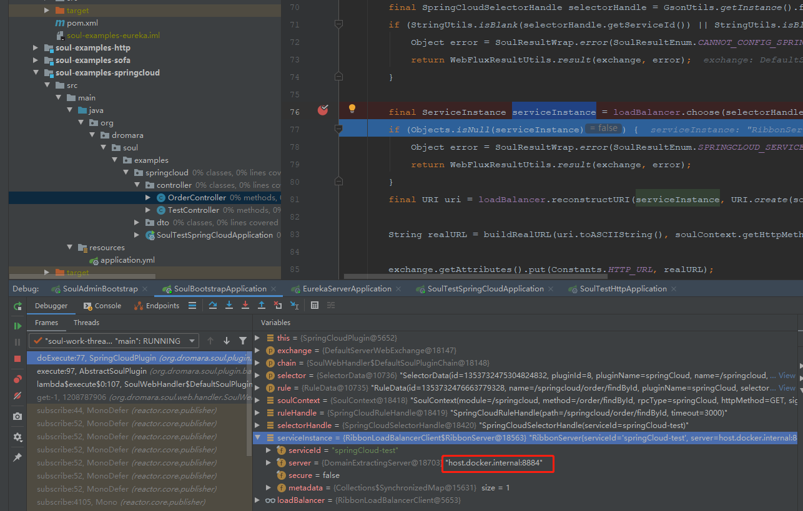
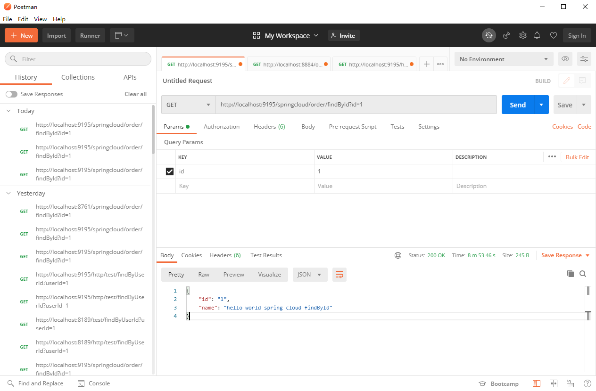
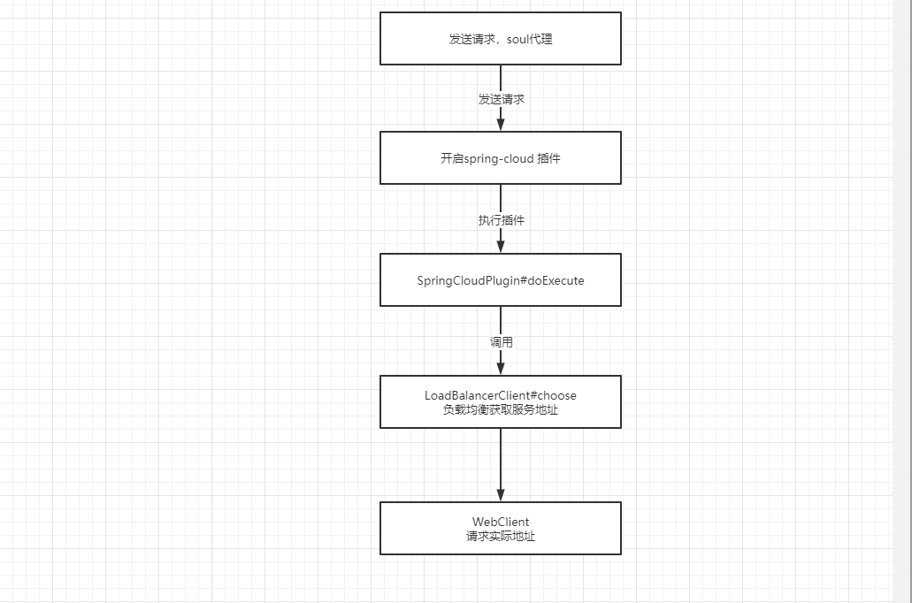

#### 插件分析之`spring-cloud`

##### 1. 前言

* 前几篇文章分析过 `divide`、`dubbo`插件，感觉对`soul` 插件的理解不够深入，所以，今天分析一下 `spring-cloud` 插件

##### 2. 源码分析

* 引入依赖

  ```yaml
  <!--soul springCloud plugin start-->
  <dependency>
       <groupId>org.dromara</groupId>
       <artifactId>soul-spring-boot-starter-plugin-springcloud</artifactId>
       <version>${project.version}</version>
   </dependency>
  
   <dependency>
       <groupId>org.springframework.cloud</groupId>
       <artifactId>spring-cloud-commons</artifactId>
       <version>2.2.0.RELEASE</version>
   </dependency>
   <dependency>
       <groupId>org.springframework.cloud</groupId>
       <artifactId>spring-cloud-starter-netflix-ribbon</artifactId>
       <version>2.2.0.RELEASE</version>
   </dependency>
  
   <!--soul springCloud plugin start end-->
  
  <!--  springCloud if you config register center is nacos please dependency this-->
   <!--dependency>
       <groupId>com.alibaba.cloud</groupId>
       <artifactId>spring-cloud-starter-alibaba-nacos-discovery</artifactId>
       <version>2.1.0.RELEASE</version>
   </dependency>-->
  
   <!-- springCloud if you config register center is eureka please dependency end-->
   <dependency>
       <groupId>org.springframework.cloud</groupId>
       <artifactId>spring-cloud-starter-netflix-eureka-client</artifactId>
       <version>2.2.0.RELEASE</version>
   </dependency>
  ```

  ```yaml
  # soul-bootstrap application-local.yml
  eureka:
    client:
      serviceUrl:
        defaultZone: http://localhost:8761/eureka/
    instance:
      prefer-ip-address: true
  ```

* 开始分析

  > 首先依次启动 `soul-admin`、`soul-bootstrap`、`soul-examples-eureka`、`soul-examples-springcloud`
  >
  > 进入`admin` 后台开启 `springcolud`插件

* 经过前几篇的学习，这里我们执行 http://localhost:9195/springcloud/order/findById?id=1 分析整个的调用过程

  ```java
  @Override
  protected Mono<Void> doExecute(final ServerWebExchange exchange, final SoulPluginChain chain, final SelectorData selector, final RuleData rule) {
      if (Objects.isNull(rule)) {
          return Mono.empty();
      }
      final SoulContext soulContext = exchange.getAttribute(Constants.CONTEXT);
      assert soulContext != null;
      final SpringCloudRuleHandle ruleHandle = GsonUtils.getInstance().fromJson(rule.getHandle(), SpringCloudRuleHandle.class);
      final SpringCloudSelectorHandle selectorHandle = GsonUtils.getInstance().fromJson(selector.getHandle(), SpringCloudSelectorHandle.class);
      if (StringUtils.isBlank(selectorHandle.getServiceId()) || StringUtils.isBlank(ruleHandle.getPath())) {
          Object error = SoulResultWrap.error(SoulResultEnum.CANNOT_CONFIG_SPRINGCLOUD_SERVICEID.getCode(), SoulResultEnum.CANNOT_CONFIG_SPRINGCLOUD_SERVICEID.getMsg(), null);
          return WebFluxResultUtils.result(exchange, error);
      }
  	
      // 利用  spring-cloud 的LoadBalancerClient 实现负载均衡
      final ServiceInstance serviceInstance = loadBalancer.choose(selectorHandle.getServiceId());
      if (Objects.isNull(serviceInstance)) {
          Object error = SoulResultWrap.error(SoulResultEnum.SPRINGCLOUD_SERVICEID_IS_ERROR.getCode(), SoulResultEnum.SPRINGCLOUD_SERVICEID_IS_ERROR.getMsg(), null);
          return WebFluxResultUtils.result(exchange, error);
      }
      // 下面两行代码，是获取和组装实际可以访问的全地址路径
      final URI uri = loadBalancer.reconstructURI(serviceInstance, URI.create(soulContext.getRealUrl()));
  
      String realURL = buildRealURL(uri.toASCIIString(), soulContext.getHttpMethod(), exchange.getRequest().getURI().getQuery());
  
      exchange.getAttributes().put(Constants.HTTP_URL, realURL);
      //set time out.
      exchange.getAttributes().put(Constants.HTTP_TIME_OUT, ruleHandle.getTimeout());
      return chain.execute(exchange);
  }
  ```

  

  **上图展示是 `LoadBalancerClient` 客户端寻找到的真正服务地址，其原理是根据 `根据传入的服务名serviceId，从负载均衡器中挑选一个对应服务的实例`**

  ```java
  @Override
  public Mono<Void> execute(final ServerWebExchange exchange, final SoulPluginChain chain) {
      final SoulContext soulContext = exchange.getAttribute(Constants.CONTEXT);
      assert soulContext != null;
      String urlPath = exchange.getAttribute(Constants.HTTP_URL);
      if (StringUtils.isEmpty(urlPath)) {
          Object error = SoulResultWrap.error(SoulResultEnum.CANNOT_FIND_URL.getCode(), SoulResultEnum.CANNOT_FIND_URL.getMsg(), null);
          return WebFluxResultUtils.result(exchange, error);
      }
      long timeout = (long) Optional.ofNullable(exchange.getAttribute(Constants.HTTP_TIME_OUT)).orElse(3000L);
      int retryTimes = (int) Optional.ofNullable(exchange.getAttribute(Constants.HTTP_RETRY)).orElse(0);
      log.info("The request urlPath is {}, retryTimes is {}", urlPath, retryTimes);
      HttpMethod method = HttpMethod.valueOf(exchange.getRequest().getMethodValue());
  	// 下面是使用 WebClient 调用最终的方法
      WebClient.RequestBodySpec requestBodySpec = webClient.method(method).uri(urlPath);
      return handleRequestBody(requestBodySpec, exchange, timeout, retryTimes, chain);
  }
  ```

  小结：以上则为`spring-cloud` 插件代理请求的核心处理步骤

* 演示调用

  

  

##### 3.总结

* 大致处理流程如下



* 经过分析，`spring-cloud`插件的使用，其核心原理是 `LoadBalancerClient`实现负载均衡，根据服务id获取到服务地址，然后，通过WebClient 请求服务，获取返回值