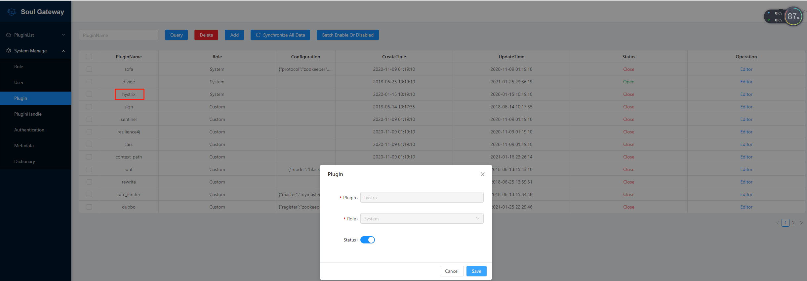
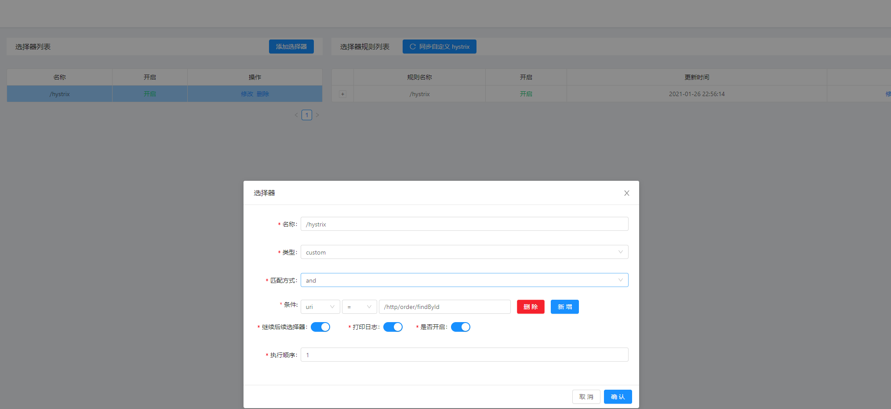
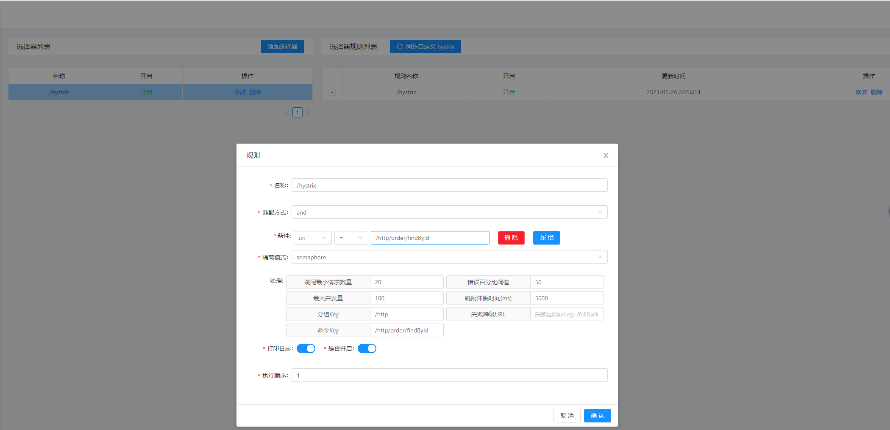
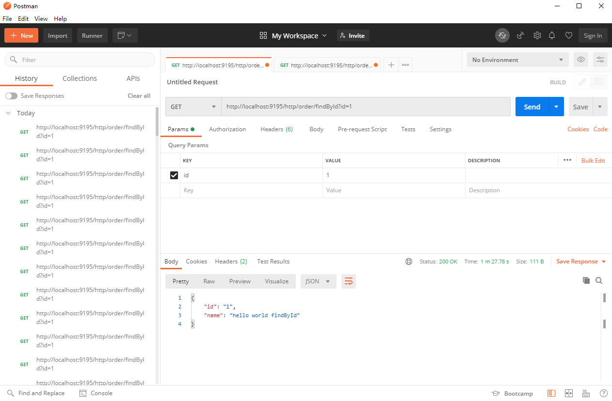
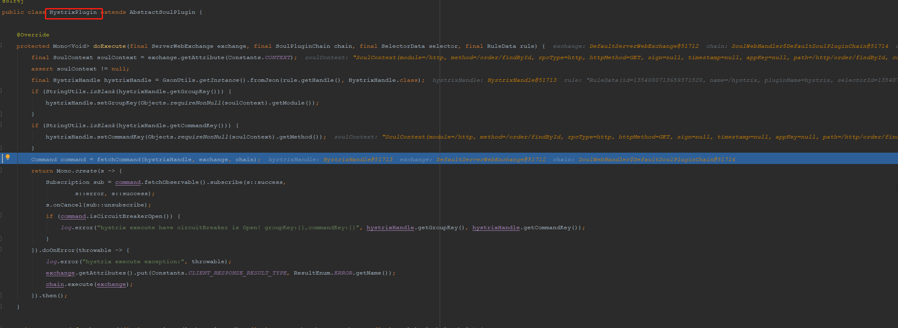

#### `hystrix`、`resilienc4j`、`sentinel` 比较

##### 1. 前言

* 首先我们依次将三个插件跑起来

##### 2. `hystrix `插件

* 含义
  > hystrix插件是网关用来对流量进行熔断的核心实现。
  >
  > 使用信号量的方式来处理请求。

* `soul-admin`后台打开插件

  

* 引入`hystrix `支持

  ```yaml
  # soul-bootstrap
  <dependency>
      <groupId>org.dromara</groupId>
      <artifactId>soul-spring-boot-starter-plugin-hystrix</artifactId>
      <version>${project.version}</version>
  </dependency>
  ```

* 配置`hystrix`选择器

  

* 配置规则

  

  **解释说明** 

  > - 跳闸最小请求数量 ：最小的请求量，至少要达到这个量才会触发熔断
  > - 错误半分比阀值 ： 这段时间内，发生异常的百分比。
  > - 最大并发量 ： 最大的并发量
  > - 跳闸休眠时间(ms) ：熔断以后恢复的时间。
  > - 分组Key： 一般设置为:contextPath
  > - 命令Key: 一般设置为具体的 路径接口。

  [官网地址](https://dromara.org/zh-cn/docs/soul/plugin-hystrix.html)

* 访问http请求，体验`hystrix`插件 （**我这里是启动了一个 http服务，打开 divide插件**）

  

* 检查`hytrix` 插件是否成功启用

  

  **我们发现，程序已经实际执行到`HystrixPlugin#doExecute` ,明天继续深入分析其中的核心逻辑，如何实现流量的熔断的**

##### **3. 总结**

* 今天将 `hytrix` 如何配置以及如何使用梳理了一遍，在配置选择器与规则时，遇到问题，通过不断的debug代码，了解代码中的大致规则
* 明天真正体验 `htyrix` 插件的核心功能，流量的熔断