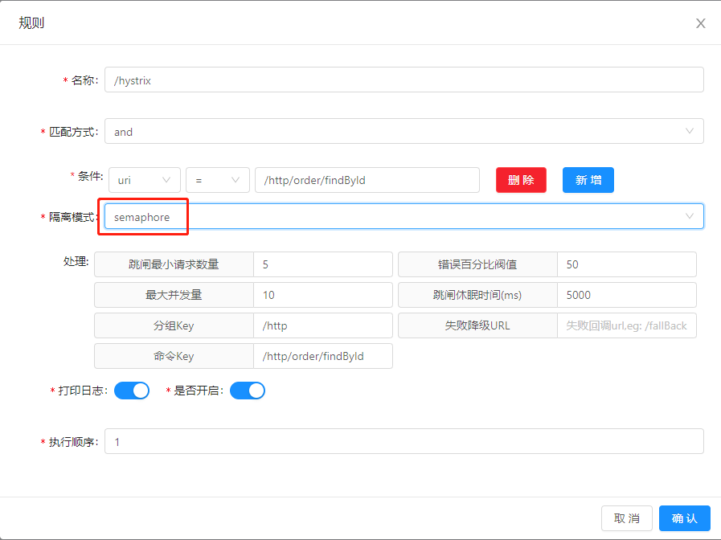

#### 理解` Hystrix` 机制

[参考文章](https://github.com/KuanYa/soul-study/tree/main/day09)

#### 1. semaphore 模式

* 通过上一篇的分析，了解`hystrix` 基本的使用方法，今天首先了解 `semaphore` 模式

  

  ```java
  private Command fetchCommand(final HystrixHandle hystrixHandle, 
                               final ServerWebExchange exchange, 
                               final SoulPluginChain chain) {
      	// 此处会判断当前使用的隔离模式是什么
          if (hystrixHandle.getExecutionIsolationStrategy() == HystrixIsolationModeEnum.SEMAPHORE.getCode()) {
              // semaphore 模式
              return new HystrixCommand(HystrixBuilder.build(hystrixHandle),
                  exchange, chain, hystrixHandle.getCallBackUri());
          }
      	// thread 模式
          return new HystrixCommandOnThread(HystrixBuilder.buildForHystrixCommand(hystrixHandle),
              exchange, chain, hystrixHandle.getCallBackUri());
      }
  ```

  ```java
  // 构建 HystrixObservableCommand.Setter
  public static HystrixObservableCommand.Setter build(final HystrixHandle hystrixHandle) {
      initHystrixHandleOnRequire(hystrixHandle);
      HystrixCommandGroupKey groupKey = HystrixCommandGroupKey.Factory.asKey(hystrixHandle.getGroupKey());
      HystrixCommandKey commandKey = HystrixCommandKey.Factory.asKey(hystrixHandle.getCommandKey());
      HystrixCommandProperties.Setter propertiesSetter =
              HystrixCommandProperties.Setter()
                      .withExecutionTimeoutInMilliseconds((int) hystrixHandle.getTimeout())
                      // 开启
                      .withCircuitBreakerEnabled(true)
                      // 执行隔离的策略
                      .withExecutionIsolationStrategy(HystrixCommandProperties.ExecutionIsolationStrategy.SEMAPHORE)
                      // 最大请求书
                      .withExecutionIsolationSemaphoreMaxConcurrentRequests(hystrixHandle.getMaxConcurrentRequests())
                      // 请求错误百分比阀值，
                      .withCircuitBreakerErrorThresholdPercentage(hystrixHandle.getErrorThresholdPercentage())
                      // 跳闸的最小请求数 ---》 决定断路器是否打开的失败率阈值
                      .withCircuitBreakerRequestVolumeThreshold(hystrixHandle.getRequestVolumeThreshold())
                      // 跳闸休眠时间 -------》决定断路器何时进入半打开的状态的时间间隔定
                      .withCircuitBreakerSleepWindowInMilliseconds(hystrixHandle.getSleepWindowInMilliseconds());
      return HystrixObservableCommand.Setter
              .withGroupKey(groupKey)
              .andCommandKey(commandKey)
              .andCommandPropertiesDefaults(propertiesSetter);
  }
  ```

* 经过分析上述核心代码后，`soul`网关的`hystrix` 插件时基于`Netflix 开源的 Hystrix`，以下是`Hystrix` 是如何实现断路器的

  > `Hystrix `的断路器也包含三种状态：关闭、打开、半打开。
  >
  > `Hystrix` 会把每一次服务调用都用 `HystrixCommand` 封装起来，它会实时记录每一次服务调用的状态，包括成功、失败、超时还是被线程拒绝。
  >
  > 当一段时间内服务调用的失败率高于设定的阈值后，`Hystrix` 的断路器就会进入进入打开状态，新的服务调用就会直接返回，不会向服务提供者发起调用。再等待设定的时间间隔后，`Hystrix` 的断路器又会进入半打开状态，新的服务调用又可以重新发给服务提供者了；
  >
  > 如果一段时间内服务调用的失败率依然高于设定的阈值的话，断路器会重新进入打开状态，否则的话，断路器会被重置为关闭状态。

  其中决定断路器是否打开的失败率阈值可以通过下面这个参数来设定：

  > HystrixCommandProperties.circuitBreakerErrorThresholdPercentage()

  而决定断路器何时进入半打开的状态的时间间隔可以通过下面这个参数来设定：

  > HystrixCommandProperties.circuitBreakerSleepWindowInMilliseconds()

* 如何实现一段时间内服务调用的失败率？

  > 滑动窗口算法

  
  * Hystrix 通过滑动窗口来对数据进行统计，默认情况下，滑动窗口包含 10 个桶，每个桶时间宽度为 1 秒，每个桶内记录了这 1 秒内所有服务调用中成功的、失败的、超时的以及被线程拒绝的次数。当新的 1 秒到来时，滑动窗口就会往前滑动，丢弃掉最旧的 1 个桶，把最新 1 个桶包含进来。
  * 任意时刻，Hystrix 都会取滑动窗口内所有服务调用的失败率作为断路器开关状态的判断依据，这 10 个桶内记录的所有失败的、超时的、被线程拒绝的调用次数之和除以总的调用次数就是滑动窗口内所有服务的调用的失败率。

  **以上关于`Hystrix` 的内容是来源于`极客时间-从0学微服务第21讲`** https://time.geekbang.org/column/article/41297

* 压测，触发熔断

  > sb -u http://localhost:9195/http/order/findById?id=1 -c 20 -N 60

  我们在`admin`中将`跳闸最小请求数量 设置为5 `、`最大并发量 设置为10`执行上述命令

  **观察是否可以正常熔断，但是没找到好的方式观察是否成功熔断，早点休息，明天继续其他插件，统一比较**

* **总结**：`hystrix`插件实现熔断机制主要基于`Netflix 开源的 Hystrix`,通过分析源码及查找资料，了解学习了基本流程，`soul`中，可以得知，插件存在先后的执行顺，例如，本次学习的`hystrix`插件 是在 `divide `插件执行前首先执行，来达到对容量的一个控制及限制作用。