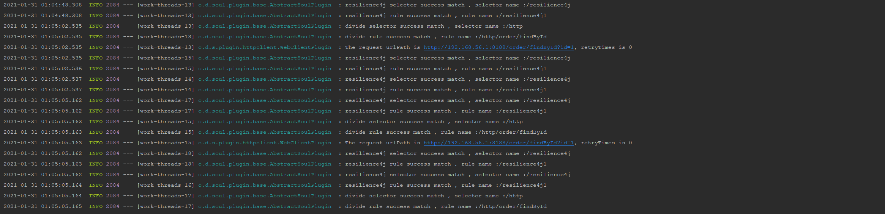
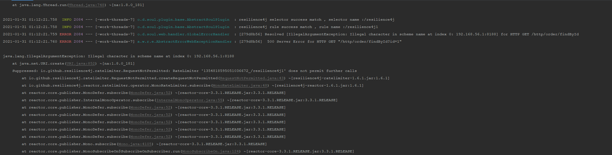
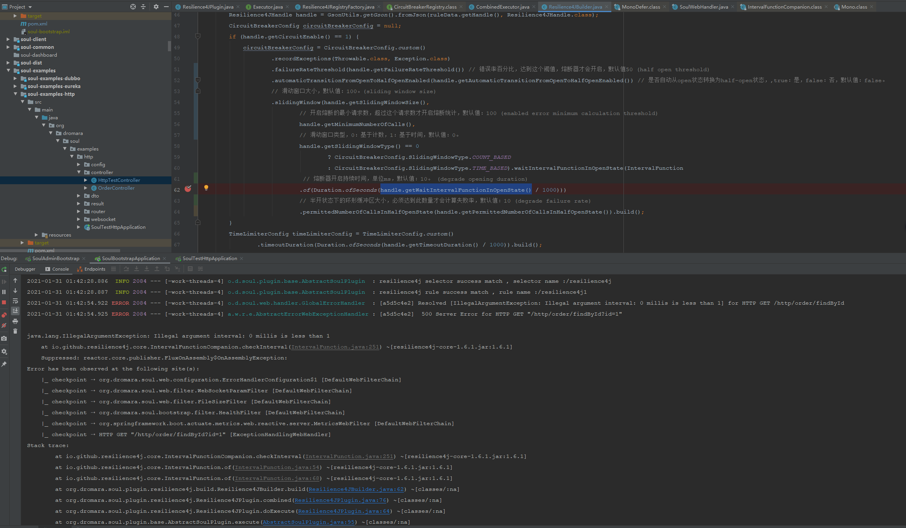
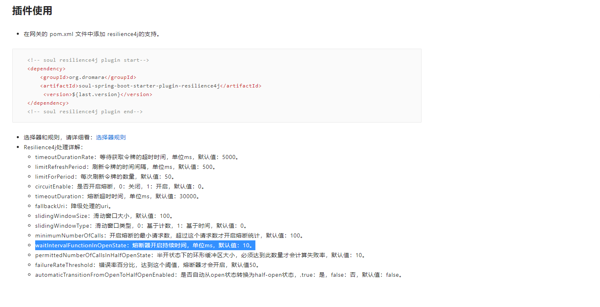

#### `Resilience4JPlugin `分析二

##### 1.`Resilience4JPlugin` 插件熔断的大致流程

* 设置如下参数
  * `circuit enable` 设置为1，打开熔断开关
  * `enabled error minimum calculation threshold` 开启熔断的最小请求数，目前设置为 100
  * `fallback uri` 失败回调降级URL

* 压测触发熔断

  ````
  # 10个请求持续一秒
  sb -u http://localhost:9195/http/order/findById?id=1 -c 10 -N 1
  ````

  观察：未发现熔断现象，请求可以正常响应

  

  ```
  # 10个请求，持续十秒，达到熔断的临界值
  sb -u http://localhost:9195/http/order/findById?id=1 -c 10 -N 10
  ```

  观察：出现响应错误情况

  

* 小结：经过上述的压测，发现当达到熔断阈值的时候，会出现服务无法响应，会请求到回调降级路径上，证明，此时是触发了熔断的

#####　２．代码分析

````java
// 执行熔断器方法
private Mono<Void> combined(final ServerWebExchange exchange, final SoulPluginChain chain, final RuleData rule) {
    // 设置 熔断器的配置  
    Resilience4JConf conf = Resilience4JBuilder.build(rule);
    	// 此处会先执行 combinedExecutor#run 方法后， 判断是否触发熔断，来回调 fallback
        return combinedExecutor.run(
                chain.execute(exchange).doOnSuccess(v -> {
                    if (exchange.getResponse().getStatusCode() != HttpStatus.OK) {
                        HttpStatus status = exchange.getResponse().getStatusCode();
                        exchange.getResponse().setStatusCode(null);
                        throw new CircuitBreakerStatusCodeException(status);
                    }
                }), fallback(combinedExecutor, exchange, conf.getFallBackUri()), conf);
    }
````

```java
public static Resilience4JConf build(final RuleData ruleData) {
        Resilience4JHandle handle = GsonUtils.getGson().fromJson(ruleData.getHandle(), Resilience4JHandle.class);
        CircuitBreakerConfig circuitBreakerConfig = null;
    	// 设置 熔断器的配置，相关参数如下    
    if (handle.getCircuitEnable() == 1) {
            circuitBreakerConfig = CircuitBreakerConfig.custom()
                    .recordExceptions(Throwable.class, Exception.class)
                	// 错误率百分比，达到这个阈值，熔断器才会开启，默认值50 (half open threshold)
                    .failureRateThreshold(handle.getFailureRateThreshold()) 
                	// 是否自动从open状态转换为half-open状态，,true：是，false：否，默认值：false。
                    .automaticTransitionFromOpenToHalfOpenEnabled(handle.getAutomaticTransitionFromOpenToHalfOpenEnabled()) 
                    // 滑动窗口大小，默认值：100。(sliding window size)
                    .slidingWindow(handle.getSlidingWindowSize(),
                            // 开启熔断的最小请求数，超过这个请求数才开启熔断统计，默认值：100 (enabled error minimum calculation threshold)
                            handle.getMinimumNumberOfCalls(),
                            // 滑动窗口类型，0：基于计数，1：基于时间，默认值：0。
                            handle.getSlidingWindowType() == 0
                                    ? CircuitBreakerConfig.SlidingWindowType.COUNT_BASED
                                    : CircuitBreakerConfig.SlidingWindowType.TIME_BASED).waitIntervalFunctionInOpenState(IntervalFunction
                             // 熔断器开启持续时间，单位ms，默认值：10。 (degrade opening duration)
                            .of(Duration.ofSeconds(handle.getWaitIntervalFunctionInOpenState() / 1000)))
                            // 半开状态下的环形缓冲区大小，必须达到此数量才会计算失败率，默认值：10 (degrade failure rate)
                            .permittedNumberOfCallsInHalfOpenState(handle.getPermittedNumberOfCallsInHalfOpenState()).build();
        }
        TimeLimiterConfig timeLimiterConfig = TimeLimiterConfig.custom()
                .timeoutDuration(Duration.ofSeconds(handle.getTimeoutDuration() / 1000)).build();
        RateLimiterConfig rateLimiterConfig = RateLimiterConfig.custom()
                .limitForPeriod(handle.getLimitForPeriod())
                .timeoutDuration(Duration.ofSeconds(handle.getTimeoutDurationRate() / 1000))
                .limitRefreshPeriod(Duration.ofNanos(handle.getLimitRefreshPeriod() * 1000000)).build();
        return new Resilience4JConf(Resilience4JHandler.getResourceName(ruleData), handle.getFallbackUri(), rateLimiterConfig, timeLimiterConfig, circuitBreakerConfig);
    }
```

````java
 @Override
    public <T> Mono<T> run(final Mono<T> run, 
                           final Function<Throwable, Mono<T>> fallback, 
                           final Resilience4JConf resilience4JConf) {
        RateLimiter rateLimiter = Resilience4JRegistryFactory.rateLimiter(resilience4JConf.getId(), resilience4JConf.getRateLimiterConfig());
        CircuitBreaker circuitBreaker = Resilience4JRegistryFactory.circuitBreaker(resilience4JConf.getId(), resilience4JConf.getCircuitBreakerConfig());
        Mono<T> to = run.transformDeferred(CircuitBreakerOperator.of(circuitBreaker))
                .transformDeferred(RateLimiterOperator.of(rateLimiter))
                .timeout(resilience4JConf.getTimeLimiterConfig().getTimeoutDuration())
                .doOnError(TimeoutException.class, t -> circuitBreaker.onError(
                        resilience4JConf.getTimeLimiterConfig().getTimeoutDuration().toMillis(),
                        TimeUnit.MILLISECONDS,
                        t));
        if (fallback != null) {
            // 只有触发熔断时，才会执行fallback 
            to = to.onErrorResume(fallback);
        }
        return to;
    }
````

```java
// 执行 fallback
default Mono<Void> fallback(ServerWebExchange exchange, String uri, Throwable t) {
    if (StringUtils.isBlank(uri)) {
        return withoutFallback(exchange, t);
    }
    DispatcherHandler dispatcherHandler = SpringBeanUtils.getInstance().getBean(DispatcherHandler.class);
    // 执行 fallback url
    ServerHttpRequest request = exchange.getRequest().mutate().uri(Objects.requireNonNull(UriUtils.createUri(uri))).build();
    ServerWebExchange mutated = exchange.mutate().request(request).build();
    return dispatcherHandler.handle(mutated);
}
```


##### 3.总结

经过今天的分析，了解了soul 中 `Resilience4JPlugin` 熔断器的一些基本参数功能，也知道了熔断器的大致执行流程，但是，一些`Resilience4J` 底层原理还需要深入挖掘

注意：`degrade opening duration` 这个参数，熔断器的开启时间，下次的测试，需要在熔断器开启时间之后测试。

##### 4.问题

* 根据官方文档中的提示，熔断器的开启时间默认为10ms，但是，当设置熔断器的参数时，如下代码会报错，认为属于bug,记录一下

  ```java
  circuitBreakerConfig = CircuitBreakerConfig.custom()
          .recordExceptions(Throwable.class, Exception.class)
          .failureRateThreshold(handle.getFailureRateThreshold()) // 错误率百分比，达到这个阈值，熔断器才会开启，默认值50 (half open threshold)
          .automaticTransitionFromOpenToHalfOpenEnabled(handle.getAutomaticTransitionFromOpenToHalfOpenEnabled()) // 是否自动从open状态转换为half-open状态，,true：是，false：否，默认值：false。
          // 滑动窗口大小，默认值：100。(sliding window size)
          .slidingWindow(handle.getSlidingWindowSize(),
                  // 开启熔断的最小请求数，超过这个请求数才开启熔断统计，默认值：100 (enabled error minimum calculation threshold)
                  handle.getMinimumNumberOfCalls(),
                  // 滑动窗口类型，0：基于计数，1：基于时间，默认值：0。
                  handle.getSlidingWindowType() == 0
                          ? CircuitBreakerConfig.SlidingWindowType.COUNT_BASED
                          : CircuitBreakerConfig.SlidingWindowType.TIME_BASED).waitIntervalFunctionInOpenState(IntervalFunction
                   // 熔断器开启持续时间，单位ms，默认值：10。 (degrade opening duration)
  				 // 此处会报错                                                                    
                  .of(Duration.ofSeconds(handle.getWaitIntervalFunctionInOpenState() / 1000)))
                  // 半开状态下的环形缓冲区大小，必须达到此数量才会计算失败率，默认值：10 (degrade failure rate)
                  .permittedNumberOfCallsInHalfOpenState(handle.getPermittedNumberOfCallsInHalfOpenState()).build();
  ```

  



