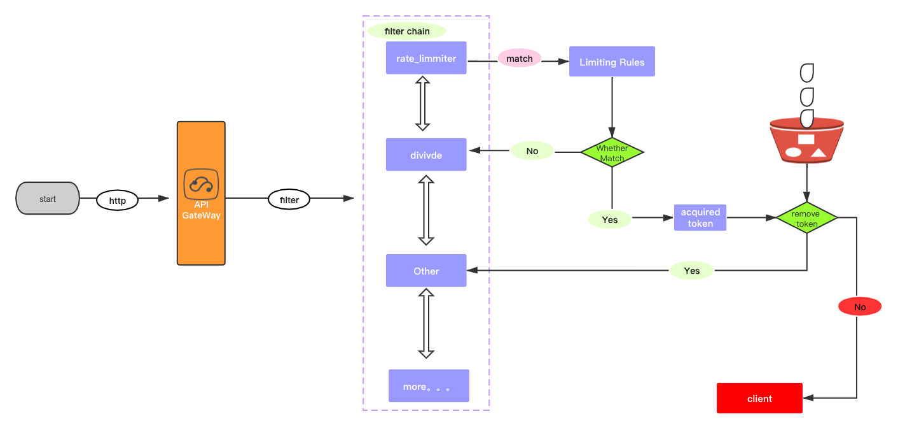
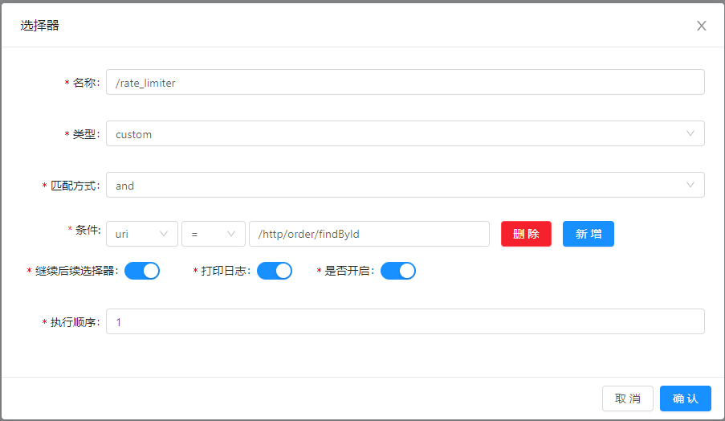
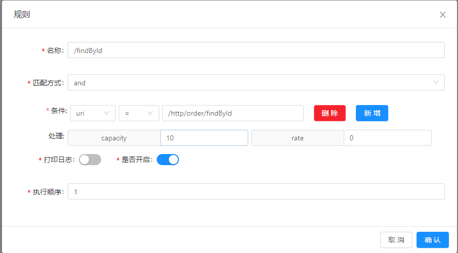

#### rateLimiter 限流插件

##### 1.前言

* 限流插件，是网关对流量管控限制核心的实现。
* 可以到接口级别，也可以到参数级别，具体怎么用，还得看你对流量配置。

##### 2.原理

* 采用redis令牌桶算法进行限流。

  

其他请[参考官网](https://dromara.org/zh/projects/soul/rate-limiter-plugin/)

##### 3. 使用`rateLimiter` 插件

* 选择器配置

  

* 规则配置

  

  本人开启 `divide` 插件，开启`http` 服务

* 调用`rateLimiter`

  * 初始化插件配置

    ````java
    public class RateLimiterPluginConfiguration {
        
        /**
         * RateLimiter plugin.
         *
         * @return the soul plugin
         */
        @Bean
        public SoulPlugin rateLimiterPlugin() {
        	// 读取lua 脚本
            return new RateLimiterPlugin(new RedisRateLimiter());
        }
        
        /**
         * Rate limiter plugin data handler plugin data handler.
         *
         * @return the plugin data handler
         */
        @Bean
        public PluginDataHandler rateLimiterPluginDataHandler() {
            // 可以理解为 redis 的配置创建
            return new RateLimiterPluginDataHandler();
        }
    }
    ````

    ```java
    
    private RedisScript<List<Long>> redisScript() {
            DefaultRedisScript redisScript = new DefaultRedisScript<>();
            redisScript.setScriptSource(
                // 获取lua脚本
                new ResourceScriptSource(new ClassPathResource("/META-INF/scripts/request_rate_limiter.lua")));
            redisScript.setResultType(List.class);
            return redisScript;
        }
    ```

    ```java
    public void handlerPlugin(final PluginData pluginData) {
        if (Objects.nonNull(pluginData) && pluginData.getEnabled()) {
            //init redis
            RateLimiterConfig rateLimiterConfig = GsonUtils.getInstance().fromJson(pluginData.getConfig(), RateLimiterConfig.class);
            // spring data redisTemplate
            if (Objects.isNull(Singleton.INST.get(ReactiveRedisTemplate.class))
                    || Objects.isNull(Singleton.INST.get(RateLimiterConfig.class))
                    || !rateLimiterConfig.equals(Singleton.INST.get(RateLimiterConfig.class))) {
                LettuceConnectionFactory lettuceConnectionFactory = createLettuceConnectionFactory(rateLimiterConfig);
                lettuceConnectionFactory.afterPropertiesSet();
                RedisSerializer<String> serializer = new StringRedisSerializer();
                RedisSerializationContext<String, String> serializationContext =
                        RedisSerializationContext.<String, String>newSerializationContext().key(serializer).value(serializer).hashKey(serializer).hashValue(serializer).build();
                ReactiveRedisTemplate<String, String> reactiveRedisTemplate = new SoulReactiveRedisTemplate<>(lettuceConnectionFactory, serializationContext);
                Singleton.INST.single(ReactiveRedisTemplate.class, reactiveRedisTemplate);
                Singleton.INST.single(RateLimiterConfig.class, rateLimiterConfig);
            }
        }
    }
    ```

  * 执行`rateLimiter` 插件

    ```java
    @Override
    protected Mono<Void> doExecute(final ServerWebExchange exchange, final SoulPluginChain chain, final SelectorData selector, final RuleData rule) {
        final String handle = rule.getHandle();
        final RateLimiterHandle limiterHandle = GsonUtils.getInstance().fromJson(handle, RateLimiterHandle.class);
        return redisRateLimiter.isAllowed(rule.getId(), limiterHandle.getReplenishRate(), limiterHandle.getBurstCapacity())
                .flatMap(response -> {
                    if (!response.isAllowed()) {
                        exchange.getResponse().setStatusCode(HttpStatus.TOO_MANY_REQUESTS);
                        Object error = SoulResultWrap.error(SoulResultEnum.TOO_MANY_REQUESTS.getCode(), SoulResultEnum.TOO_MANY_REQUESTS.getMsg(), null);
                        return WebFluxResultUtils.result(exchange, error);
                    }
                    return chain.execute(exchange);
                });
    }
    ```

    ```java
    public Mono<RateLimiterResponse> isAllowed(final String id, final double replenishRate, final double burstCapacity) {
        if (!this.initialized.get()) {
            throw new IllegalStateException("RedisRateLimiter is not initialized");
        }
        // 通过规则id生成 keys
        List<String> keys = getKeys(id);
        List<String> scriptArgs = Arrays.asList(replenishRate + "", burstCapacity + "", Instant.now().getEpochSecond() + "", "1");
        Flux<List<Long>> resultFlux = Singleton.INST.get(ReactiveRedisTemplate.class).execute(this.script, keys, scriptArgs);
        return resultFlux.onErrorResume(throwable -> Flux.just(Arrays.asList(1L, -1L)))
                .reduce(new ArrayList<Long>(), (longs, l) -> {
                    longs.addAll(l);
                    return longs;
                }).map(results -> {
                    boolean allowed = results.get(0) == 1L;
                    Long tokensLeft = results.get(1);
                    RateLimiterResponse rateLimiterResponse = new RateLimiterResponse(allowed, tokensLeft);
                    log.info("RateLimiter response:{}", rateLimiterResponse.toString());
                    return rateLimiterResponse;
                }).doOnError(throwable -> log.error("Error determining if user allowed from redis:{}", throwable.getMessage()));
    }
    ```

##### 4.总结

​	今天先分析到这里，了解了`rateLimiter`插件的一个基本实现原理，但是 对令牌桶算法的原理还不是很清楚，需要深入学习，本次只列列举了一些核心的代码，其中具体逻辑还需要深入分析，不过，今天还是收获了一些之前未了解的知识点的，明天继续分析。

​	